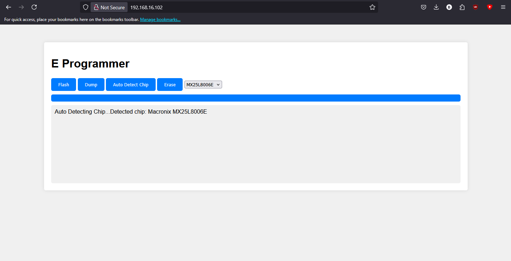

# E Programmer

A lightweight flashing tool for SPI flash chips built for MicroPython. It provides a simple web interface to read, write, and erase flash memory using JSON-RPC and the Microdot framework.

- can flash 3.3V chips (maybe also 5V, but not tested).
- by adding a simple isolator to step down the voltage like TXS0108E and lowering
  the SPI speed allows to flash even 1.2V chips



## Features
- Block-wise flash memory read/write.
- Web interface for flashing and dumping chip data.
- Asynchronous operations with MicroPython.

## Flashing Instructions

### 1. Get the Latest MicroPython Firmware

- Visit [micropython.org/download](https://micropython.org/download) and download the latest firmware for your ESP board (e.g., ESP32 or ESP8266).
- For ESP32, you might download a file like `esp32-<version>.bin`.

### 2. Flash the Firmware to Your ESP Board

Use a flashing tool such as [esptool.py](https://github.com/espressif/esptool) to erase the existing firmware and write the new one. For example, on Windows open a Command Prompt and run:

````bash
python -m esptool --chip esp32 --port COM3 erase_flash
python -m esptool --chip esp32 --port COM3 write_flash -z 0x1000 esp32-<version>.bin
````

### 3. Deploy the E Programmer Project
Once the latest MicroPython firmware is running:

Remove unnessesary files like .git folder and use a tool like Pymakr (VS Code extension), ampy, or rshell to upload the project files.
For example with ampy, you can upload the project folder as follows (replace COM3 with the correct port):

````bash
ampy --port COM3 put d:\Downloads\E-P_BIOS_flasher
````

### 4. Optional: Update network
Once powered up, the ESP attempts to connect to network defined in network_conn.py,
if it fails, it creates it's own network. You can connect to it,
and use the flasher at http://192.168.4.1
# Beware, connecting the ESP directly makes for a quite a bit slower connection

**ESP Board to Windbond SPI Flash Connection Scheme:**

- **Power:**
  - ESP 3.3V → Windbond VCC (Pin 8)
  - ESP GND   → Windbond GND (typically Pin 4)
  - **Additionally:** Connect Windbond pins 7 (often HOLD or /RESET) and 8 to 3.3V (if not already tied to VCC) as needed.

- **SPI Signals:**
  - ESP GPIO14 (SCK) → Windbond CLK (usually Pin 6)
  - ESP GPIO13 (MOSI) → Windbond DI  (usually Pin 5)
  - ESP GPIO12 (MISO) → Windbond DO  (usually Pin 2)
  - ESP GPIO11 (CS)   → Windbond CS  (usually Pin 1)

**Note:**  
Double-check your flash chip datasheet as the pin numbering (especially for HOLD, WP) might differ between models. The above wiring is based on your code and common Windbond pinouts.

Feel free to adjust wiring if you use different ESP pins.

## Lessons Learned
- **Speed Limitation:** Fast transfers are limited by MicroPython's lwIP TCP buffer size.
- **Protocol Complexity:** UPP/UDP-based Web protocols are too complex for MCU environments.
- **Modern Web Limitations:** Complying with secure modern Web standards brings complexity overhead.
- **Future Consideration:** Dropping MicroPython could greatly increase transfer speeds.

## Contributing
Contributions of any kind are welcome! Feel free to submit issues or pull requests.

## License
This project is licensed under the MIT License.